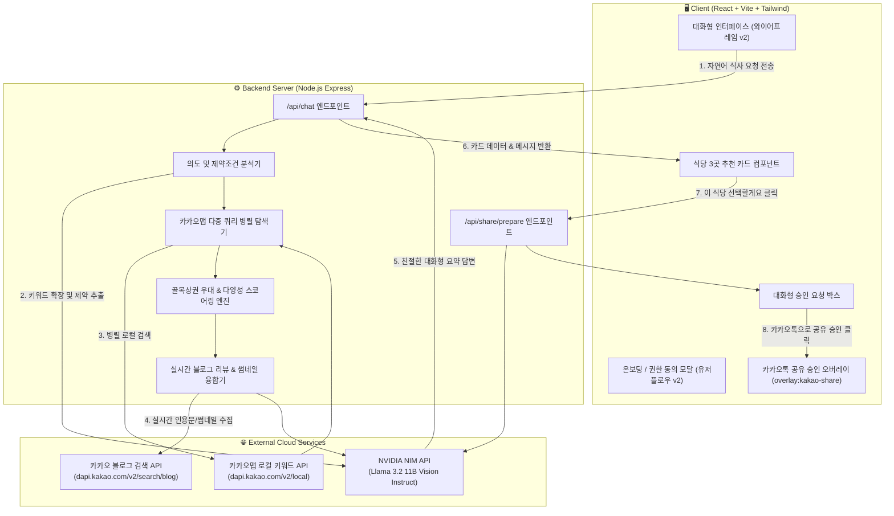

# 광운대 능동형 로컬 미식 에이전트 — 기술 스택, 아키텍처 및 상세 기능 명세서

> **프로젝트명**: 광운대 능동형 로컬 미식 에이전트 (Local Gourmet Agent)  
> **기획 기반**: Manyfast PRD, 유저플로우 v2, 와이어프레임 v2  
> **최종 커밋**: `ef5a482` (feat: 사용자 요청별 카카오맵 연관 키워드 다중 확장 및 실시간 다양성 추천 고도화)

---

## 1. 프로젝트 개요

광운대학교 학생들은 예산·인원·취향을 동시에 고려해 식당을 정해야 하지만, 일반 포털 및 지도 검색 결과는 프랜차이즈와 대형 리뷰 식당에 집중되기 쉽습니다. 또한 공강 시간에는 식당까지의 도보 이동 시간과 식사 시간을 합산한 총 소요 시간이 매우 중요합니다.

본 서비스는 학생의 자연어 요청으로부터 **공강 시간, 예산, 인원, 메뉴 취향**을 실시간 추출하고, **NVIDIA NIM LLM**과 **실시간 카카오맵 & 카카오 블로그 API**를 융합하여 광운로 인근 숨은 **골목 상권 소상공인 맛집 3곳**을 발굴·추천하며, 친구와의 식당 결정을 돕는 **카카오톡 공유 승인 연동**을 제공합니다.

---

## 2. 기술 스택 (Tech Stack)

### 💻 프론트엔드 (Frontend)
| 기술 / 라이브러리 | 버전 | 용도 및 채택 이유 |
| :--- | :---: | :--- |
| **React** | `^18.3.1` | 컴포넌트 기반 반응형 UI 및 대화형 상태 관리 |
| **Vite** | `^6.1.0` | 초고속 개발 서버 HMR 및 프로덕션 번들 최적화 |
| **Tailwind CSS** | `^3.4.17` | 직관적인 유틸리티 퍼스트 스타일링 및 모바일 뷰포트 완벽 대응 |
| **Lucide React** | `^0.475.0` | 깔끔하고 모던한 UI/UX 벡터 아이콘 세트 |
| **Pretendard** | `v1.3.9` | 가독성 높은 한국어 웹 타이포그래피 표준 적용 |

### ⚙️ 백엔드 (Backend)
| 기술 / 라이브러리 | 버전 | 용도 및 채택 이유 |
| :--- | :---: | :--- |
| **Node.js** | `v22` (ESM) | 최신 ES 모듈 기반 고성능 비동기 I/O 런타임 |
| **Express** | `^4.21.2` | RESTful API 라우팅 및 정적 에셋 서빙 |
| **dotenv** | `^16.4.7` | 민감한 API Key 격리 및 환경 변수 안전 관리 |
| **cors** | `^2.8.5` | 개발 환경 교차 출처 리소스 공유 제어 |
| **concurrently** | `^9.1.2` | 프론트엔드(Vite)와 백엔드(Node) 단일 명령 동시 구동 (`npm run dev`) |

### 🧠 인공지능 (LLM)
| 서비스 / 모델 | 제공사 | 역할 |
| :--- | :---: | :--- |
| **NVIDIA NIM API** | NVIDIA | 고성능 엔터프라이즈 AI 추론 인프라 |
| **`meta/llama-3.2-11b-vision-instruct`** | Meta / NVIDIA | 1) 사용자 자연어 질의 분석 및 제약조건(예산, 인원, 공강시간) 슬롯 추출 2) 상황별 카카오맵 음식/업종 검색어 동적 확장 3) 친절한 대화형 요약 및 코딩 에이전트식 승인 요청 문구 생성 |

### 🗺️ 외부 연동 API (External Services)
| API 명칭 | 제공처 | 상세 용도 |
| :--- | :---: | :--- |
| **카카오맵 로컬 키워드 검색 API** | Kakao Developers | 광운대 중심 좌표(`x: 127.0583, y: 37.6193`) 반경 1.5~2km 내 음식점(`FD6`) 실시간 위치, 미터 단위 도보 거리, 도로명 주소 탐색 |
| **카카오 블로그 검색 API** | Kakao Developers | 추천된 식당의 실시간 방문 블로그 글, 핵심 인용문(Quote), 원문 링크, 사진 썸네일 수집 및 매핑 |
| **Web Share API / Clipboard API** | Web Standard | 카카오톡 공유 모달 연동 및 클립보드 복사 폴백 지원 |
| **Google Calendar URL Scheme** | Google | 식사 일정 캘린더 등록 연동 |

---

## 3. 시스템 아키텍처 (System Architecture)

### 3.1 전체 구조도

---

### 3.2 핵심 알고리즘 및 데이터 파이프라인

#### ① 다중 쿼리 동적 확장 (Multi-pass Query Expansion)
사용자의 자연어 표현은 카카오맵 매장명과 직접 일치하지 않는 경우가 많습니다(예: "매콤한 거", "가성비 혼밥"). 따라서 상황별 키워드 매핑 사전을 통해 3~4개의 구체적인 업종 쿼리로 자동 분기하여 병렬 검색합니다:
* **"매콤한 거"** ➡️ `['마라탕', '짬뽕', '닭갈비', '떡볶이', '불고기']` ➡️ `미식성`, `한식밥상`, `진짜루` 등 발굴
* **"파스타/피자"** ➡️ `['파스타', '양식', '피자', '스테이크']` ➡️ `반올림피자`, `프랭크버거`, `맘스터치 피자앤치킨` 등 발굴
* **"혼밥 가성비 국밥"** ➡️ `['순대국', '백반', '국수', '덮밥']` ➡️ `소문난 소머리국밥&순대국밥`, `장수국수`, `쉐프밥버거` 등 발굴

#### ② 종합 스코어링 & 소상공인 가중치
수집된 30~50여 개의 중복 제거된 식당 후보들에 대해 다차원 평가 점수를 산출합니다:
$$\text{Score} = S_{\text{local}} + S_{\text{distance}} + S_{\text{budget}} + S_{\text{time}} + S_{\text{match}} + S_{\text{jitter}}$$
* **소상공인 우대 ($S_{\text{local}}$)**: 대기업 프랜차이즈가 아닌 골목 상권 매장에 가중치 (+20점)
* **도보 이동 거리 ($S_{\text{distance}}$)**: 캠퍼스 기준 5분 이내(+15점), 10분 이내(+8점), 10분 초과(-15점)
* **예산 적합도 ($S_{\text{budget}}$)**: 사용자 희망 1인 예산 이내(+25점), 초과 시(-35점)
* **공강 시간 적합도 ($S_{\text{time}}$)**: $\text{총 소요시간} = (\text{편도 도보} \times 2) + \text{예상 식사시간}(25\text{분})$. 학생의 공강 시간 이내일 경우(+20점), 촉박할 경우(-30점)
* **로테이션 지터 ($S_{\text{jitter}}$)**: 0~15점 사이의 난수 지터를 부여하여 동일한 질문을 반복해도 상위권의 다양한 식당들이 로테이션되어 새로운 골목 맛집을 지속 발견

#### ③ 다양성 필터 (Diversity Enforcement)
점수 순으로 상위 3곳을 선정할 때, 추천 목록 전체가 돈까스나 고기집 등 특정 1개 카테고리에 편중되지 않도록 서로 다른 업종을 교차 선별합니다.

---

## 4. 상세 기능 명세 (Feature Details)

### 4.1 인증 및 온보딩 (유저플로우 v2: `s1`)
* **앱 최초 실행 (`n1` ➡️ `n2`)**: 서비스 목적(공강시간 맞춤, 골목상권 활성화, 에이전트 승인)을 시각적으로 안내하는 온보딩 모달 팝업
* **로그인 선택 분기 (`n3`)**:
  - `카카오 계정으로 간편 시작` (`n4` ➡️ `n5`): 카카오 인증 흐름 시뮬레이션
  - `게스트로 바로 체험하기`: 로그인 없이 즉시 메인 대화 홈 진입 가능
* **서비스 권한 동의 (`n6` ➡️ `n8`)**:
  - **카카오톡 메시지 전송 및 공유 권한 (필수)**: 친구 대화방에 추천 카드 공유를 위한 권한 (대화방 열람 권한 없음으로 프라이버시 보호)
  - **캘린더 일정 추가 권한 (선택)**: 방문 식당 및 식사 시간 캘린더 등록 권한

### 4.2 AI 대화 홈 (와이어프레임 v2: `s2`)
* **직관적인 챗봇 레이아웃**: 상단 헤더(유저 프로필 뱃지, v2 에이전트 뱃지), 대화 스크롤 영역, 하단 입력창
* **퀵 프롬프트 칩 (Quick Chips)**:
  - *"혼자 먹기 좋은 곳이요, 예산은 만 원 이내로요"*
  - *"오늘 3명이서 인당 1만 원 이하로 매콤한 거 먹고 싶은데, 공강이 90분이야"*
  - *"친구랑 파스타나 피자 먹고 싶어"*
  - *"공강 30분인데 초스피드로 먹을 수 있는 가성비 식당 있어?"*
* **실시간 분석 로딩 인디케이터**: LLM 및 카카오맵 검색 중 회전 스피너와 상태 메시지 노출

### 4.3 식당 3곳 추천 카드 (`RestaurantCard`)
* **식당 사진**: 실시간 카카오 블로그 검색 썸네일 우선 매핑 (없을 시 카테고리별 고화질 푸드 사진)
* **태그 및 뱃지**: `[로컬 맛집]`, `[소상공인]`, 음식 카테고리 뱃지
* **거리 및 가격**: 편도 도보 시간(분) 및 1인 평균 가격 표시
* **총 소요 시간 배지**: 왕복 도보 + 식사 예상 시간(약 25분) 합산 시간 표기 및 학생 공강 시간 여유 상태 표시
* **블로그 핵심 인용문(Quote)**: 실제 방문자의 솔직한 한줄평 인용 및 출처 표시
* **액션 버튼**:
  - `[이 식당 선택할게요]` (Primary): AI 승인 요청 흐름 트리거
  - `[블로그 원문]` (Secondary): 카카오/네이버 블로그 원문 새 창 열기

### 4.4 코딩 에이전트식 승인 요청 및 카카오톡 공유 (`KakaoShareOverlay`)
* **대화형 승인 요청 (Agentic Approval Flow)**:
  - 사용자가 식당 카드의 `이 식당 선택할게요`를 누르면, AI가 대화창 내에 승인 요청 박스 생성 (*"OO을(를) 선택하셨군요! 카카오톡으로 친구에게 공유할까요? 😊"*)
  - `[취소]` 또는 `[카카오톡으로 공유 승인]` 버튼 제공
* **카카오톡 공유 오버레이 모달 (`overlay:kakao-share`)**:
  - 카카오톡 메시지 카드 미리보기 (제목, 위치, 도보시간, 추천 사유)
  - **공유 문구 직접 수정 기능**: 친구들에게 함께 보낼 코멘트(예: *"같이 점심 먹을 사람? 12시에 출발!"*) 자유 편집
  - **카카오톡 공유 전송**: Web Share API 지원 환경 시 즉시 카카오톡 연동, 데스크톱 환경 시 클립보드 자동 복사 및 토스트 알림
  - **캘린더 일정 추가**: 원클릭으로 Google Calendar에 식당 방문 일정 등록

---

## 5. 보안 및 형상 관리 (Security & Git Management)

* **비공개 API Key 완전 격리**:
  - 사용자의 NVIDIA NIM API Key 및 Kakao REST API Key는 루트 디렉터리의 [`.env`](file:///d:/Sera/Documents/2026-2/kwhack2/.env)에만 저장
  - 프론트엔드 코드 번들에는 API Key가 절대 주입되지 않으며, 백엔드 프록시 서버(`server/services`)에서만 안전하게 호출
* **Git 보안 정책**:
  - [`.gitignore`](file:///d:/Sera/Documents/2026-2/kwhack2/.gitignore)에 `.env`, `.env.*` 등록을 통해 `git add` 및 커밋 시 원천 배제 확인 완료 (`git check-ignore -v .env` 검증 통과)
  - 안전한 공유를 위해 플레이스홀더 템플릿인 [`.env.example`](file:///d:/Sera/Documents/2026-2/kwhack2/.env.example)만 저장소에 추적
