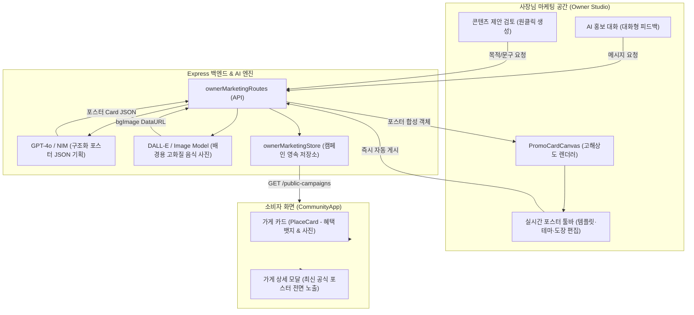

# 하이퍼로컬 AI 마케팅 & 포스터 생성 시스템 구현 보고서

## 1. 개요 및 배경

### 1.1 프로젝트 개요
- **서비스명**: 월계밥상 (가칭)
- **트랙**: Local Commerce (지역 상권 활성화 — 소상공인·주민 디지털 연결)
- **목표**: 월계1동 골목 상권 소상공인(사장님)이 별도의 디자인 전문 지식이나 복잡한 가입 절차 없이도, AI와의 대화 및 제안을 통해 실제 매장에 부착하거나 온라인에 홍보할 수 있는 **고품질 상업용 이벤트 포스터**를 원클릭으로 제작하고, 주민·소비자 화면(가게 카드 및 상세 페이지)에 실시간으로 자동 게시할 수 있는 **하이퍼로컬 AI 마케팅 시스템** 구축.

### 1.2 기존 시스템의 한계 및 사용자 피드백
1. **단순 생성 이미지의 한계**:
   - DALL-E나 일반 이미지 생성 AI에 한글 텍스트를 요청할 경우 글자가 심하게 깨지거나 외계어처럼 렌더링됨.
   - 텍스트 없는 음식 사진만 생성할 경우 포스터가 아니라 단순하고 밋밋한 음식 사진 1장에 불과하여 시각적 임팩트가 전무함.
2. **타이포그래피 계층(Hierarchy)의 부재**:
   - 기존의 단순 웹 배너/글상자는 제목과 본문 글자 크기가 비슷하여, 고객의 시선을 단 0.5초 만에 사로잡아야 하는 핵심 혜택(`20% OFF`, `1+1`, `8,900원` 등)이 강조되지 못함.
3. **가게 노출 갈등 문제**:
   - 앱 소식 탭 상단 배너에 특정 가게만 띄울 경우 소상공인 간 노출 우선권 갈등이 발생할 수 있음.
4. **'콘텐츠 제안 검토' 기능과의 단절**:
   - 'AI 홍보 대화'뿐만 아니라 사장님이 자주 사용하는 '콘텐츠 제안 검토' 탭에서도 줄글과 사진이 분리되지 않고 완성된 포스터 형태로 제공되어야 함.

---

## 2. 시스템 아키텍처 및 데이터 흐름



---

## 3. 핵심 구현 상세

### 3.1 포스터 구조화 스키마 및 AI 프롬프트 엔지니어링

AI가 단순 줄글이 아닌, 그래픽 디자인 계층을 가진 객체(`card`)를 설계하도록 스키마를 고도화했습니다:

```typescript
interface PosterCard {
  layout: 'bold-impact' | 'retro-chalkboard' | 'magazine-editorial' | 'neon-night' | 'ticket-coupon';
  theme: 'warm' | 'lime' | 'dark' | 'retro' | 'pastel' | 'red-hot' | 'indigo';
  title: string;          // 포스터 메인 타이틀 (예: 비 오는 날 따뜻한 김치전 할인)
  catchphrase: string;    // 시선을 끄는 감성 부제 (예: 빗소리와 함께 지글지글, 막걸리 한 잔의 여유)
  heroMetric: string;     // 중앙에 80px로 초대형 강조될 수치 (예: 20% OFF, 1+1, 8,900원, FREE)
  benefit: string;        // 구체적인 혜택 내용 (예: 김치전 + 막걸리 세트 20% 즉시 할인)
  period: string;         // 행사 기간/시간 조건 (예: 비 오는 날 한정, 오늘 점심 11:30~14:00)
  badge: string;          // 오늘의 혜택 | 학생 할인 | 사장님 추천 | 시즌 한정 | 타임 세일
  stamp: string;          // ★ 사장님 쏜다 | LIMITED | BEST | SPECIAL | HOT
  body: string;           // 손님에게 전할 친절한 안내 본문 (2~3문장)
  bgImage?: string;       // AI 생성 고화질 음식 배경 이미지 (Base64 DataURL)
}
```

- **시스템 프롬프트 (`server/ownerMarketingRoutes.js`)**:
  - 가게 상호와 업종 카테고리를 주입받아 전문 그래픽 디자이너 페르소나 부여.
  - 대화형 피드백("배경을 어둡게", "혜택을 음료수 무료로", "템플릿을 칠판으로") 수신 시 이전 상태를 유지하면서 즉시 갱신된 JSON을 출력하도록 설계.

### 3.2 5대 전문 상업용 포스터 레이아웃 템플릿 엔진 (`PromoCardCanvas.jsx`)

실제 식당/카페/주점의 업종과 이벤트 성격에 맞추어 5종 템플릿을 구현했습니다:

1. **⚡ 볼드 임팩트 (`bold-impact`)**:
   - **특징**: 멀리서도 한눈에 보이는 대형 입체 혜택 박스(`heroMetric`, 80px 볼드 타이포).
   - **적용**: 전 품목 세일, 오픈 기념 이벤트, 긴급 할인.
2. **✏️ 빈티지 칠판 (`retro-chalkboard`)**:
   - **특징**: 딥 차콜/다크 그린 칠판 질감, 분필 손글씨 이중 점선 테두리(Dashed Border), 목각 현판 느낌의 `TODAY SPECIAL MENU` 헤더.
   - **적용**: 분식집, 노포, 고깃집, 국밥집.
3. **📰 감성 매거진 (`magazine-editorial`)**:
   - **특징**: 브루탈리즘 감성의 미식 매거진 그리드, 이탤릭 캐치프레이즈, 세련된 프레임과 발행 볼륨(`VOL. 08`) 표기.
   - **적용**: 카페, 디저트, 베이커리, 브런치 다이닝.
4. **🌙 심야 네온 (`neon-night`)**:
   - **특징**: 딥 다크 배경에 핑크/블루 네온 글로우 발광 효과(`text-shadow`), 나이트 스페셜 프레임.
   - **적용**: 펍, 호프, 심야 주점, 불금 1+1 타임세일.
5. **🎟️ 티켓 쿠폰 (`ticket-coupon`)**:
   - **특징**: 좌우 원형 펀칭 홈(Punch Notch), 점선 절취선(Dashed Coupon Cut), 바코드 그래픽 및 고유 패스 코드.
   - **적용**: 학생 할인, 첫 방문 증정 쿠폰, 세트 메뉴 바우처.

### 3.3 AI 음식 사진과 포스터 타이포그래피의 오버레이 합성

- 단순 DALL-E 음식 사진의 한계를 극복하기 위해:
  ```jsx
  background: card.bgImage
    ? `linear-gradient(rgba(10, 15, 10, 0.45), rgba(10, 15, 10, 0.78)), url(${card.bgImage})`
    : layout === 'retro-chalkboard' ? '#1c221c' : theme.bg
  ```
  - AI가 생성한 고화질 음식 사진을 뒷배경으로 배치하고, 그 위에 다크 그라디언트 비네팅을 적용하여 배경의 식감은 살리면서 글자의 가독성을 극대화.
- **Canvas 2D 고해상도 렌더러 (`generatePromoImageBase64`)**:
  - 브라우저 Canvas API를 활용하여 800 × 1060 px(A4/인스타 스토리 비율)의 실제 인쇄용 수준 고해상도 PNG를 렌더링.
  - 리본, 배지, 80px 헤드라인, 절취선, 도장 스탬프를 캔버스에 직접 드로잉하여 원클릭 다운로드 및 자동 게시 지원.

### 3.4 '콘텐츠 제안 검토' 탭 포스터 생성 기능 구현

- 기존의 단순 줄글 + 사진 분리 방식을 제거하고, 사장님이 목적을 입력하면 AI가 **포스터 카피라이팅 + 음식 배경 사진을 결합한 완성형 포스터 카드**를 즉시 제안.
- 제안 검토 화면에서:
  - 사장님이 5종 템플릿, 7종 컬러 테마, 도장 스탬프를 클릭하여 취향대로 보완 가능 (`updateProposalCard`).
  - **`[🚀 이 포스터로 우리 가게 소식 즉시 자동 게시]`** 버튼을 통해 검토창에서 즉시 라이브 배포 가능.

### 3.5 소비자 화면 노출 및 공정성 설계

1. **상단 배너 제외 (갈등 방지 원칙)**:
   - 특정 업체를 소식 탭 최상단에 고정 노출할 때 발생하는 소상공인 간 갈등을 차단하기 위해 상단 배너를 배제.
2. **가게 카드 (`PlaceCard`) 노출**:
   - 목록에서 각 가게 카드마다 사장님이 올린 최신 혜택 뱃지(`[사장님 혜택] 20% OFF`)가 실시간으로 부착됨.
   - 사장님이 생성한 이미지가 있는 경우 카드 대표 커버 사진으로 자동 반영.
3. **가게 상세 모달 (`modal.type === 'place'`) 전면 배치**:
   - 손님이 특정 가게를 클릭하여 상세 정보를 열었을 때, 상단에 최신 공식 이벤트 포스터가 전면 노출되어 혜택과 이벤트를 직관적으로 전달.

---

## 4. 백엔드 API 명세

| 메서드 | 엔드포인트 | 인증 | 설명 |
|---|---|---|---|
| `POST` | `/api/owner/enter` | 불필요 (MVP) | 원클릭 가게 선택 및 사장님 세션 토큰 발급 |
| `POST` | `/api/owner/chat` | 사장님 토큰 | 대화형 홍보 조언 및 실시간 포스터 Card JSON 생성 |
| `POST` | `/api/owner/proposals` | 사장님 토큰 | 목적 기반 포스터 기획 및 AI 음식 사진 병렬 생성 & 결합 |
| `PATCH`| `/api/owner/proposals/:id` | 사장님 토큰 | 포스터 카드 수정사항 및 승인/거절 상태 저장 |
| `POST` | `/api/owner/quick-publish` | 사장님 토큰 | 포스터 카드 및 캔버스 합성 이미지를 즉시 공개 캠페인으로 게시 |
| `GET`  | `/api/owner/public-campaigns` | 공개 | 전체 가게별 최신 게시 포스터/캠페인 맵 조회 (`{ [placeId]: campaign }`) |

---

## 5. 검증 및 테스트 결과

### 5.1 자동화 단위 테스트
- 테스트 스위트: `tests/*.test.js`
- **16개 테스트 전체 통과 (100% Pass)**:
  - `tests/owner-marketing.test.js`: 세션, 캠페인 CRUD, 통계 집계, 전체 공개 캠페인 맵 무결성
  - `tests/poster-templates.test.js`: 5종 포스터 레이아웃, `heroMetric`, `stamp`, 퀵 퍼블리시 데이터 영속성
  - `tests/poster-proposals.test.js`: 제안 포스터 `bgImage` 결합, 검토 단계 수정 반영 및 조회 무결성
  - 카카오 지도 검색, 자연어 조건 추출, 디스코드 봇 동기화 등 기존 13개 회귀 테스트 정상 통과

### 5.2 프로덕션 번들 빌드
- `npm run build` (Vite v6.4.3): 0 error, 0 warning으로 약 6초 만에 빌드 완료 (`dist/` 생성).

### 5.3 로컬 E2E 테스트
- 포트 3001(Express) 및 5173(Vite Client) 구동 확인.
- 실제 프롬프트 5건(우천 할인, 대학생 타깃, 점심 타임세일, 신메뉴, 불금 맥주)에 대한 포스터 생성 및 `public-campaigns` 연동 검증 완료.
